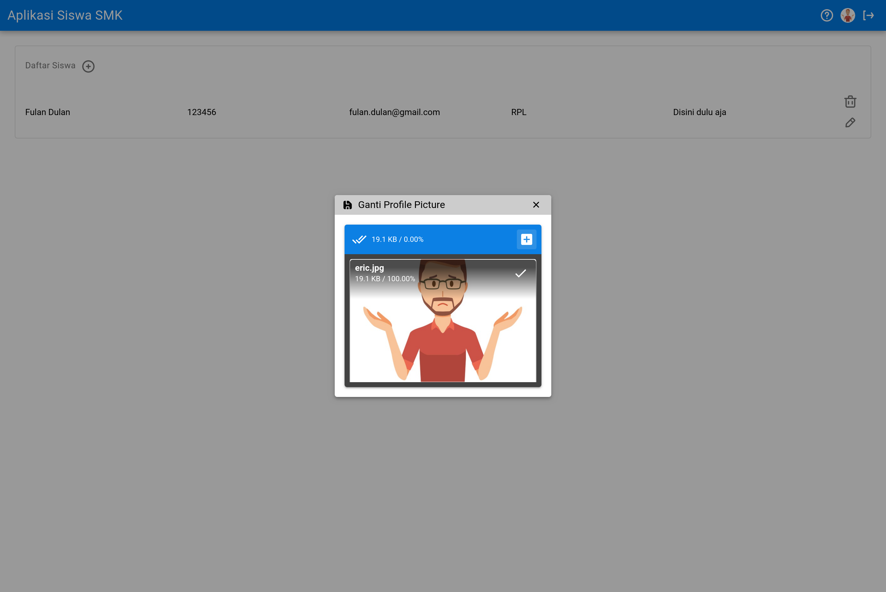
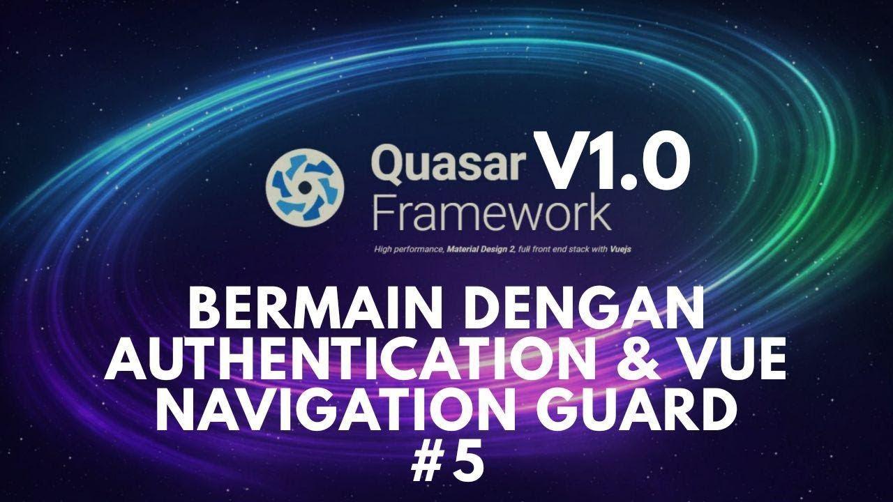

# Repositori Pengembangan Aplikasi Siswa SMK dengan Quasar Framework

Quasar framework menggunakan teknologi yang diberikan oleh VueJS dan multi platform meliputi Web (SPA, PWA, SSR), Mobile (Android, iOS) dan desktop (Electron).

Saat penulisan README ini, Quasar Framework sudah masuk ke tahap *stable* yakni versi **1.0**. Silahkan beri dukungan ke tim developer quasar framework [DISINI](https://github.com/users/rstoenescu/sponsorship).

## Pengembangan Berbasis Web

Untuk memulai pengembangan aplikasi berbasis web, ada beberapa hal yang harus dilakukan yaitu:

1. Silahkan melakukan instalasi Node JS melalui halaman berikut ini [NodeJS](https://nodejs.org/en/). Untuk melakukan instalasi Node JS di linux Ubuntu dapat dilakukan seperti tutorial [DISINI](https://youtu.be/Fxj4Aw9JxGI).
2. Lakukan instalasi QUasar Framework melalui NPM (Node Package Manager) seperti dokumentasi [DISINI](https://quasar.dev/quasar-cli/installation).
3. Ikuti instruksi yang ditunjukkan video dibawah ini.

## Pengembangan Berbasis Android

Untuk memulai pengembangan aplikasi berbasis android, ada beberapa hal yang harus dikerjakan diantaranya:

1. Melakukan instalasi cordova secara global dengan perintah di linux/unix `sudo npm install -g cordova` seperti yang dijelaskan di dokumentasi [INI](https://quasar.dev/quasar-cli/developing-mobile-apps/preparation).
2. Setelah itu, lakukan perintah `quasar build -m cordova -T android` di dalam direktori aplikasi siswa SMK (ada *package.json*). Apabila terjadi *ERROR*, abaikan dulu saja.
3. Buka *Android Studio* dan buka *Exisiting Android Project* di direktori `src-cordova/platforms/android`.
4. Ikuti instruksi yang diberikan didalam video diatas.